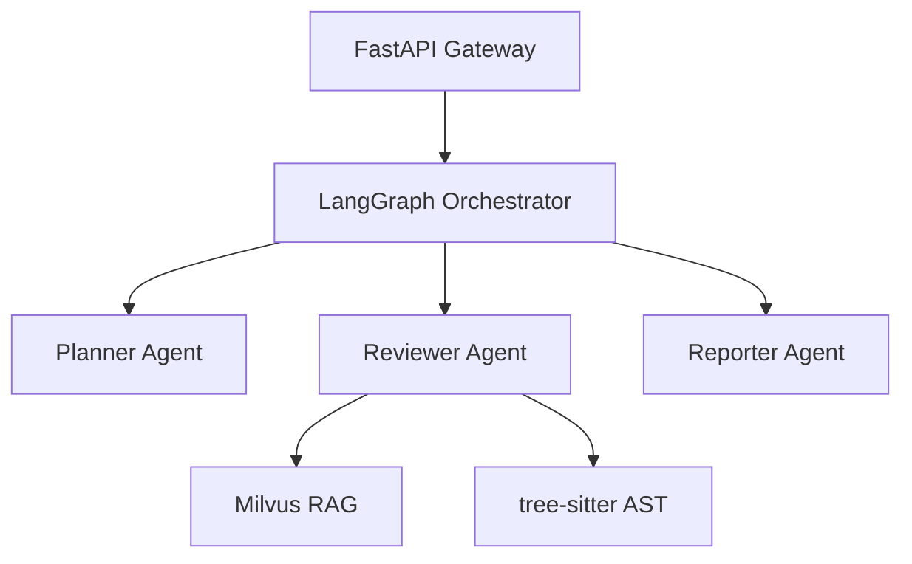

# Multi-Agent Code Reviewer

An LLM-powered code review system using multi-agent orchestration with LangGraph, Milvus RAG, and Claude API.

## Architecture



## Tech Stack

- **LLM**: Claude Sonnet 4.5 (Anthropic)
- **Agent Orchestration**: LangGraph
- **Vector DB**: Milvus + BGE-M3 embeddings
- **Code Parsing**: tree-sitter
- **Backend**: FastAPI (async)
- **Packaging**: Docker + docker-compose

## Quick Start

```bash
# Install uv
curl -LsSf https://astral.sh/uv/install.sh | sh

# Setup
uv venv && source .venv/Scripts/activate  # Windows
uv pip install -e .

# Configure
cp .env.example .env
# Edit .env and add your ANTHROPIC_API_KEY

# Test API connection
python scripts/hello.py
```

## Progress

- [x] Week 1: Environment setup, single Reviewer Agent, GitHub repo
- [ ] Week 2: Multi-Agent + RAG integration
- [ ] Week 3: FastAPI + Docker + benchmark + demo
