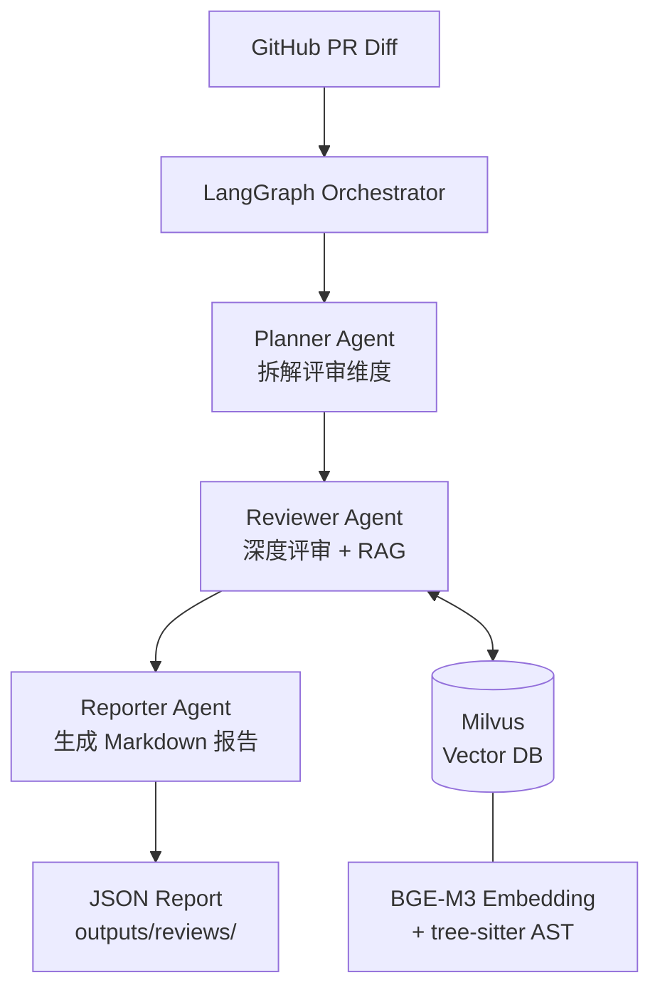

# Multi-Agent Code Reviewer

An LLM-powered GitHub PR review system built with **LangGraph multi-agent orchestration**, **Milvus RAG**, and **Claude via OpenRouter**. Designed as a portfolio project for LLM application / Agent algorithm roles.

## Architecture



**Current state (Week 1):** Planner → Reviewer → Reporter pipeline runs end-to-end on real GitHub PRs.  
**Planned (Week 2):** Milvus RAG + BGE-M3 + tree-sitter AST chunking.

## Tech Stack

| Layer | Choice |
|---|---|
| LLM | Claude Sonnet 4.6 via OpenRouter |
| Agent orchestration | LangGraph (StateGraph) |
| Vector DB | Milvus (local Docker) |
| Embedding | BGE-M3 |
| Code parsing | tree-sitter |
| Backend | FastAPI (async) |
| Structured output | Pydantic v2 |
| Package manager | uv |

## Quick Start

```bash
# 1. Clone and setup
git clone https://github.com/<your-username>/multi-agent-code-reviewer
cd multi-agent-code-reviewer

# 2. Create virtualenv and install deps (uv required)
uv venv && source .venv/Scripts/activate   # Windows
# source .venv/bin/activate                # macOS/Linux
uv pip install -e .

# 3. Configure API keys
cp .env.example .env
# Edit .env:
#   ANTHROPIC_API_KEY=sk-or-...   (OpenRouter key)
#   GITHUB_TOKEN=ghp_...          (optional, increases rate limit)

# 4. Run review on a real GitHub PR
python -c "from src.tools.review_runner import review_pr; review_pr('psf/requests', 6710)"
```

## Sample Output

```
Fetching PR #6710 from psf/requests...
Title: Add missing timeout parameter to Session.request
Files: ['requests/sessions.py', 'tests/test_sessions.py']

Running multi-agent review pipeline...
Score: 6/10 | Issues: 5
Report saved to: outputs/reviews/psf_requests_pr6710.json
```

The JSON report includes structured issues (severity, location, description) plus a Markdown summary.

## Project Structure

```
src/
├── agents/multi_agent.py     # LangGraph 3-node pipeline
├── schemas/review.py         # Pydantic v2 output schemas
├── prompts/templates.py      # System prompts + few-shot examples
└── tools/
    ├── github_fetcher.py     # PyGithub PR diff fetcher
    └── review_runner.py      # End-to-end runner + JSON saver
examples/                     # LangChain / LangGraph learning demos
tests/                        # pytest unit + integration tests
outputs/reviews/              # Saved review JSON reports
```

## Roadmap

- [x] **Week 1** — Environment, LangChain basics, LangGraph 3-node pipeline, GitHub PR fetcher, end-to-end demo
- [ ] **Week 2** — Milvus RAG integration, BGE-M3 embedding, tree-sitter AST chunking, historical bug retrieval
- [ ] **Week 3** — FastAPI gateway, Docker Compose, 20-30 PR benchmark, demo video

## Running Tests

```bash
# Unit tests only (no API calls)
python -m pytest tests/ -v -m "not integration"

# All tests including live API
python -m pytest tests/ -v
```
