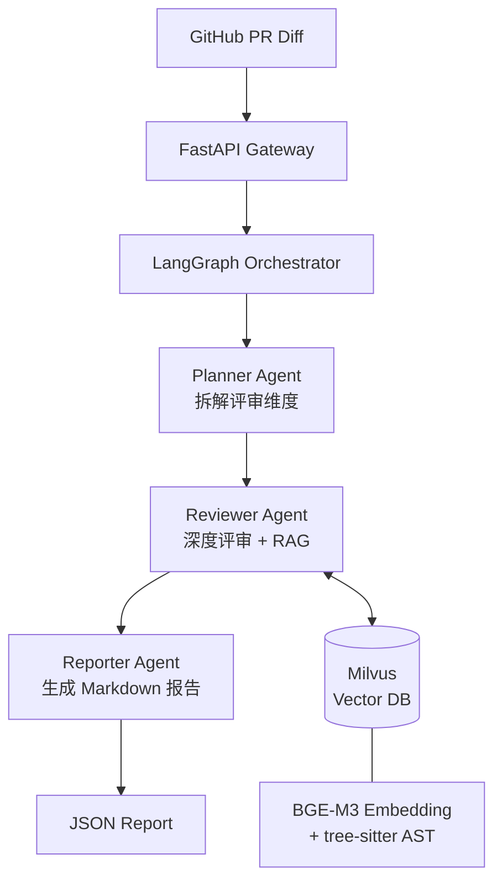

# Multi-Agent Code Reviewer

An LLM-powered GitHub PR review system built with **LangGraph multi-agent orchestration**, **Milvus RAG**, and **Claude Sonnet 4.6 via OpenRouter**. Portfolio project targeting LLM application / Agent algorithm roles.

## Architecture



## Tech Stack

| Layer | Choice |
|---|---|
| LLM | Claude Sonnet 4.6 via OpenRouter |
| Agent orchestration | LangGraph (StateGraph) |
| Vector DB | Milvus (local Docker) |
| Embedding | BGE-M3 |
| Code parsing | tree-sitter |
| Backend | FastAPI |
| Deployment | Docker + docker-compose |
| Structured output | Pydantic v2 |
| Package manager | uv |

## Quick Start

### Option A — Docker (recommended)

```bash
# 1. Clone
git clone https://github.com/<your-username>/multi-agent-code-reviewer
cd multi-agent-code-reviewer

# 2. Configure API keys
cp .env.example .env
# Edit .env:
#   OPENROUTER_API_KEY=sk-or-...
#   GITHUB_TOKEN=ghp_...   (optional, increases rate limit)

# 3. Start all services (Milvus + API)
docker compose up -d

# 4. Review a PR
curl -X POST http://localhost:8000/review \
  -H "Content-Type: application/json" \
  -d '{"repo": "psf/requests", "pr_number": 6710}'
```

### Option B — Local

```bash
uv venv && source .venv/Scripts/activate   # Windows
# source .venv/bin/activate                # macOS/Linux
uv pip install -e .

# Start Milvus (required)
docker compose up etcd minio milvus -d

# Run review directly
python -c "from src.tools.review_runner import review_pr; review_pr('psf/requests', 6710)"
```

## API

`GET /health` — liveness check

`POST /review` — run multi-agent review on a GitHub PR

```json
// Request
{ "repo": "psf/requests", "pr_number": 6710 }

// Response
{
  "repo": "psf/requests",
  "pr_number": 6710,
  "title": "...",
  "changed_files": ["requests/sessions.py"],
  "review_score": 6,
  "issues_count": 5,
  "report": "## Code Review Report\n...",
  "token_usage": {
    "input_tokens": 28450,
    "output_tokens": 3120,
    "total_tokens": 31570,
    "estimated_cost_usd": 0.1321
  }
}
```

Swagger UI available at `http://localhost:8000/docs`.

## Benchmark Results

Evaluated on **23 real merged PRs** across 6 popular Python open-source repositories.

| Repository | Domain | PRs | Avg Score | Avg Issues |
|---|---|---|---|---|
| psf/requests | HTTP client | 4 | **7.0** / 10 | 3.2 |
| pytest-dev/pytest | Test framework | 4 | 6.5 / 10 | 4.8 |
| encode/httpx | Async HTTP | 4 | 6.2 / 10 | 4.0 |
| pallets/flask | Web framework | 4 | 6.0 / 10 | 4.0 |
| huggingface/transformers | LLM / NLP | 3 | 6.0 / 10 | 5.0 |
| scikit-learn/scikit-learn | ML | 4 | 5.2 / 10 | 3.8 |
| **Overall** | | **23** | **6.2 / 10** | **4.1** |

- Score range: 4 – 10 (only perfect 10 for a pure typo-fix PR, as expected)
- Average review time: ~96s / PR
- Estimated cost: ~$0.13 / PR (Claude Sonnet 4.6 via OpenRouter)

## Project Structure

```
src/
├── agents/multi_agent.py     # LangGraph 3-node pipeline (Planner → Reviewer → Reporter)
├── schemas/review.py         # Pydantic v2 output schemas
├── prompts/templates.py      # System prompts + few-shot examples
├── api/main.py               # FastAPI gateway
├── benchmark.py              # Benchmark runner (6 repos × 4 PRs)
└── tools/
    ├── github_fetcher.py     # PyGithub PR diff fetcher
    ├── review_runner.py      # End-to-end runner + JSON saver
    ├── rag_store.py          # Milvus store + BGE-M3 embedding
    ├── code_chunker.py       # tree-sitter AST chunking
    └── token_tracker.py      # LangChain callback for token/cost tracking
examples/                     # LangChain / LangGraph learning demos
tests/                        # pytest unit + integration tests
outputs/
├── reviews/                  # Per-PR JSON review reports
└── benchmark/                # Benchmark summary JSONs
```

## Running Tests

```bash
# Unit tests only (no API calls)
python -m pytest tests/ -v -m "not integration"

# All tests including live API
python -m pytest tests/ -v
```

## Roadmap

- [x] **Week 1** — LangChain basics, LangGraph 3-node pipeline, GitHub PR fetcher, end-to-end demo
- [x] **Week 2** — Milvus RAG + BGE-M3 embedding + tree-sitter AST chunking, FastAPI gateway, Docker Compose
- [x] **Week 3** — Token usage tracking, 23-PR benchmark across 6 repos, Docker rebuild
